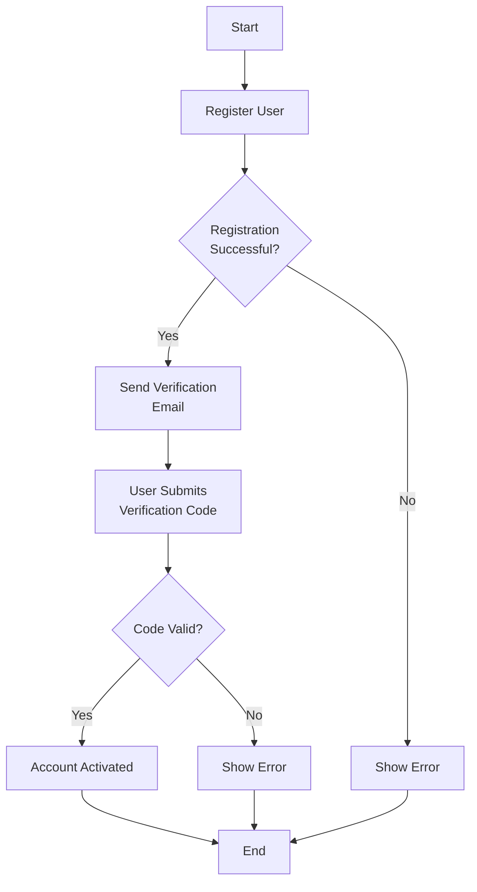

# API Flow Documentation Guidelines

## Overview
This document outlines the standard format for documenting API flows and includes a sample implementation. Please follow these guidelines when submitting new API requests.

## API Request Template

### Basic Information
- **Endpoint**: `/api/v1/[resource]`
- **Method**: `GET/POST/PUT/DELETE`
- **Description**: Brief description of what this API does

### Request Format
```json
{
    "field1": "string",
    "field2": "number",
    "field3": {
        "nested1": "string",
        "nested2": "boolean"
    }
}
```

### Response Format
```json
{
    "status": "success",
    "data": {
        "id": "string",
        "result": "object"
    },
    "message": "string"
}
```

## Sample API Flow

### User Registration Flow

#### 1. Create User Account
- **Endpoint**: `/api/v1/users`
- **Method**: `POST`
- **Description**: Register a new user account

**Request**:
```json
{
    "username": "john_doe",
    "email": "john@example.com",
    "password": "securePassword123",
    "fullName": "John Doe"
}
```

**Success Response** (200):
```json
{
    "status": "success",
    "data": {
        "userId": "12345",
        "username": "john_doe",
        "email": "john@example.com",
        "createdAt": "2025-03-20T10:00:00Z"
    },
    "message": "User created successfully"
}
```

**Error Response** (400):
```json
{
    "status": "error",
    "code": "USER_EXISTS",
    "message": "Username or email already exists"
}
```

#### 2. Verify Email
- **Endpoint**: `/api/v1/users/verify`
- **Method**: `POST`
- **Description**: Verify user's email address

**Request**:
```json
{
    "userId": "12345",
    "verificationCode": "123456"
}
```

**Success Response** (200):
```json
{
    "status": "success",
    "data": {
        "verified": true,
        "timestamp": "2025-03-20T10:05:00Z"
    },
    "message": "Email verified successfully"
}
```

## Flow Diagram



## Testing Guidelines

1. **Prerequisites**
   - Test environment URL
   - Valid test credentials
   - Postman/API testing tool

2. **Test Cases**
   - Positive scenarios
   - Error scenarios
   - Edge cases

3. **Validation Checklist**
   - [ ] Request format
   - [ ] Response format
   - [ ] Status codes
   - [ ] Error handling
   - [ ] Performance metrics

## Best Practices

1. **Naming Conventions**
   - Use kebab-case for endpoints
   - Use camelCase for JSON properties
   - Use descriptive names for parameters

2. **Error Handling**
   - Include specific error codes
   - Provide clear error messages
   - Handle all possible error scenarios

3. **Documentation**
   - Keep examples up-to-date
   - Include all required parameters
   - Document rate limits if applicable

## Additional Resources

- API Documentation Tool: [Swagger/OpenAPI](https://swagger.io/)
- Testing Tool: [Postman](https://www.postman.com/)
- Version Control: Git repository link

---

*Last Updated: March 20, 2025*

Feel free to modify this template based on your specific API requirements.
